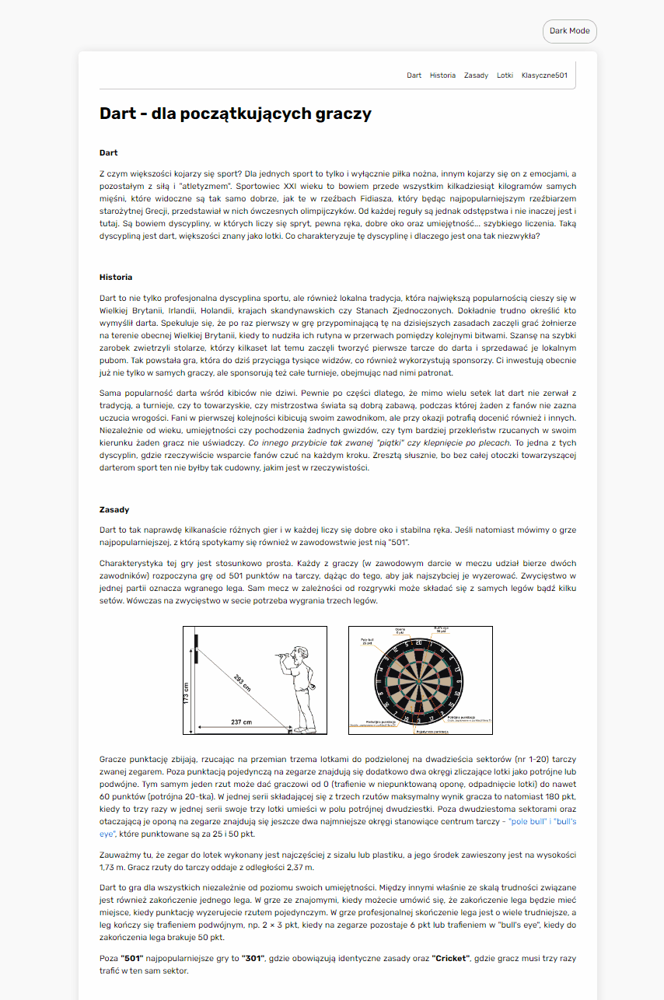

# About Darts

My first steps in Frontend development.  

---

## DEMO

https://jerszynski.github.io/about_darts/

---

#### Languages used in project:

 

- HTML
- BEM Convention
- CSS
  - Flexbox
- JavaScript ( ES6+ )

---

Welcome to my first page, where I'm showing you some basic information about Darts. Also, you can find one button to check my small interaction with a website.
 
 
Below you will see a short preview of my first page.

